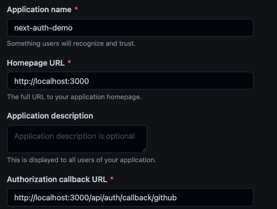

# Next.js + NextAuth.js + Prisma.io + Typescript demo

This is roughly half of the stack detailed on [init.tips](https://init.tips/).

We're using the [NextAuth.js v4 Beta](https://twitter.com/nextauthjs/status/1434508619970666506).

We loaded up most of the files with comments describing what they do and how to expand upon them. Be sure to check out:

- [`prisma/schema.prisma`](./prisma/schema.prisma)
- [`pages/index.tsx`](./pages/index.tsx)
- [`pages/_app.tsx`](./pages/_app.tsx)
- [`pages/api/auth/\[...nextauth\].ts`](./pages/api/auth/[...nextauth].ts)

## Getting Started

### Set up Github OAuth

If you will be using a different auth provider, you can skip this section

[`Create an OAuth app on Github`](https://github.com/settings/applications/new)

Make sure you have a [valid authorization callback url](https://next-auth.js.org/configuration/providers/oauth-provider#how-to) for `http://localhost:3000`.

Your setup should look something like this


Create a `.env` file in the root of your project, with your Github OAuth Client ID and Secret generated above:

- GITHUB_CLIENT_ID
- GITHUB_CLIENT_SECRET

### Run locally

Install and run

```bash
npm i
npx prisma migrate dev
npm run dev
```

## Notes

If you would like to install the same packages here and replicate this on your own, look out for this bug when you intall the beta versions of next-auth v4:
https://github.com/nextauthjs/next-auth/issues/2675

It should be resolved very soon. Will try to update this when it is :)
